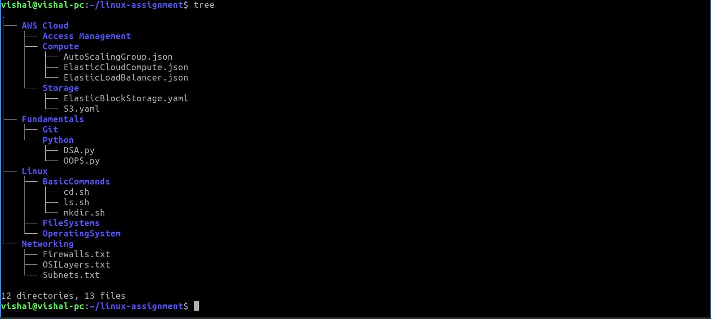

```bash
mkdir cloud-curriculum
cd cloud-curriculum
mkdir Fundamentals
cd Fundamentals
mkdir Python
cd Python
touch OOPS.py
touch DSA.py
touch Functions.py
ls
DSA.py  OOPS.py Functions.py
rm Functions.py
ls
DSA.py  OOPS.py
cd ..
mkdir Git
ls
Git  Python
cd ..
mkdir Linux
cd Linux
mkdir OperatingSystem
mkdir BasicCommands
cd BasicCommands
touch ls.sh
touch mkdir.sh
touch cd.sh
cd ..
mkdir FileSystems
cd ..
mkdir Networking
cd Networking
touch OSILayers.txt
touch Firewalls.txt
touch Subnets.txt
cd ..
mkdir AWS Cloud
cd 'AWS Cloud'
rmdir AWS
rmdir Cloud
mkdir 'AWS Cloud'
rmdir 'AWS Cloud'
mkdir AWS\ Cloud
cd 'AWS Cloud'
mkdir Compute
mkdir Storage
mkdir Access\ Management
cd Compute
touch ElasticCloudCompute.json
touch AutoScalingGroup.json
touch ElasticLoadBalancer.json
cd ..
cd Storage
touch S3.yaml
touch ElasticBlockStorage.yaml
cd ..
cd Access\ Management
cd /home/vishal
cp cloud-curriculum linux-assignment
cp -r  cloud-curriculum linux-assignment
cd linux-assignment
cd BasicCommands
cd /home/vishal
rm cloud-curriculum
rmdir cloud-curriculum
rmdir -r cloud-curriculum
rmdir -rf cloud-curriculum
rm -rf cloud-curriculum
cd linux-assignment
tree
```

