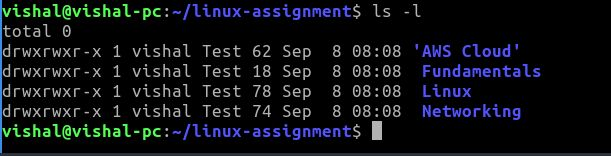

```bash
cd linux-assignment
ls -l
```


This -l argument used to display the files and folders information.
```bash
ls -la
```
.jpg)

This -a argument is used to show hidden files also.
```bash
ls -lha
```
.jpg)

This -h argument is used to show the file size in human readable.
```bash
ls -lhta
```
.jpg)

This -t argument is used to show the files in newest first.
```bash
ls -lhtra
```
.jpg)

This -r argument is used to show the files in reverse order. In this command -t show the files in newest first when we using -r it show the files oldest first.
