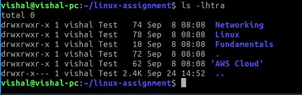

cd linux-assignment ls -l 
 
This -l argument used to display the files and folders information.  
ls -la  This -a argument is used to show hidden files also.  ls -lha  This -h argument is used to show the file size in human readable.  ls -lhta  
This -t argument is used to show the files in newest first.  ls -lhtra  
This -r argument is used to show the files in reverse order. In this command -t show the files in newest first when we using -r it show the files oldest first.