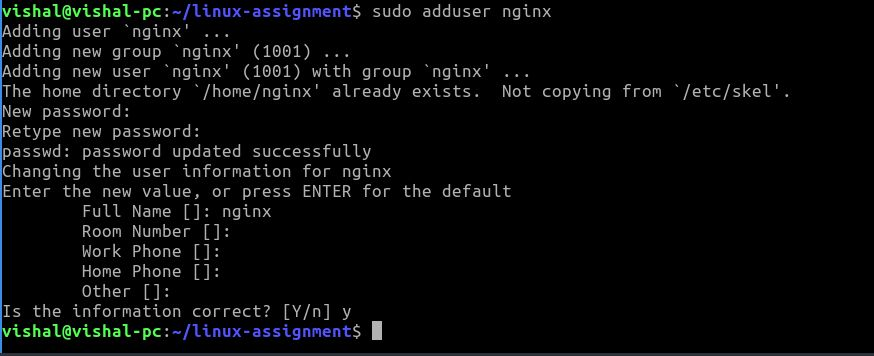
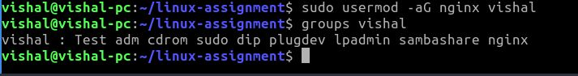
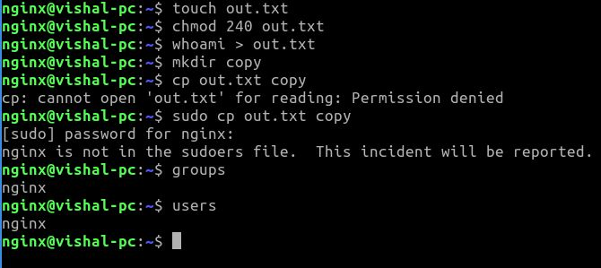
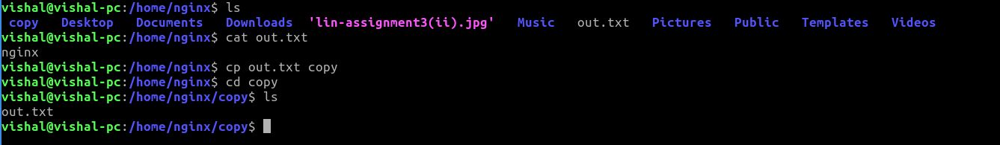

sudo adduser nginx
 
sudo usermod -aG nginx vishal
groups vishal
 
#login by the nginx user 
touch out.txt chmod 240 out.txt whoami > out.txt mkdir copy 
 
#login by the normal user cat out.txt cp out.txt copy 
 

