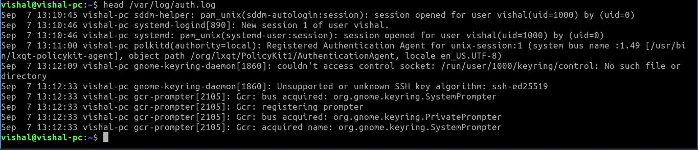
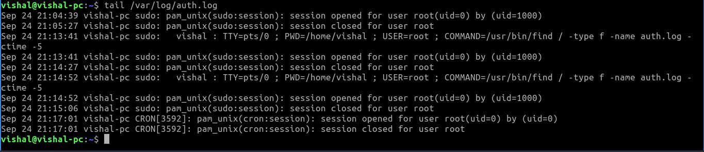
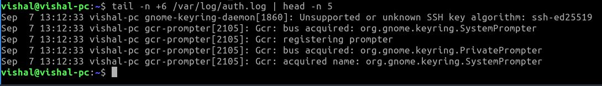
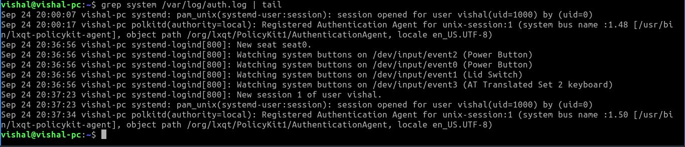
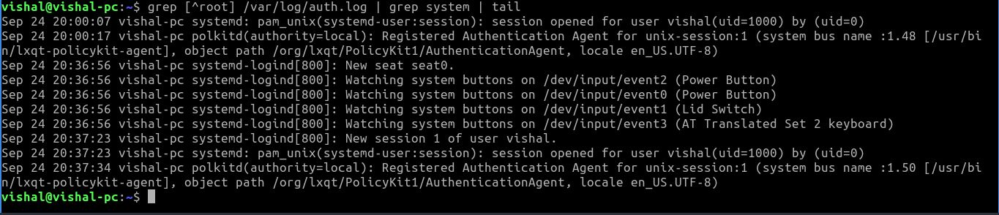
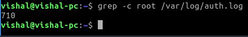

head /var/log/auth.log 
 
tail /var/log/auth.log 
 
tail -n +6 /var/log/auth.log | head -n 5 
 
grep system /var/log/auth.log | tail 
 
grep [^root] /var/log/auth.log | grep system | tail 
 
grep -c root /var/log/auth.log 
 