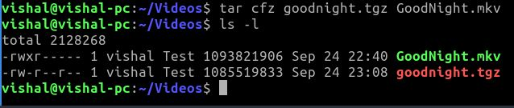

```bash
tar cfz goodnight.tgz GoodNight.mkv
```

I learned this material how to compress a file in linux terminal 
https://www.networkworld.com/article/3538471/how-to-compress-files-on-linux-5-ways.html
