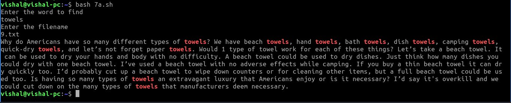
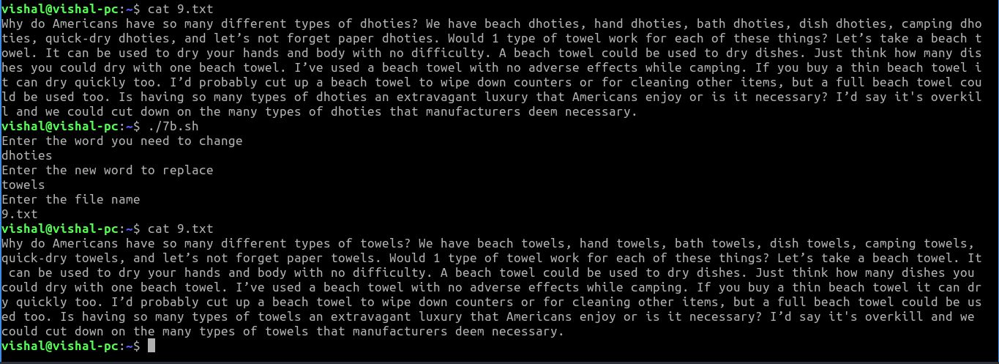

```bash
#!/usr/bin/env bash
echo "Enter the word to find"
read word
echo "Enter the filename"
read filename
grep "$word" "$filename" --color=auto
```

```bash
#!/bin/bash
echo "Enter the word you need to change "
read exist_word
echo "Enter the new word to replace "
read new_word
echo "Enter the file name "
read file_name
sed -i 1,5s/$exist_word/$new_word/g $file_name
```

